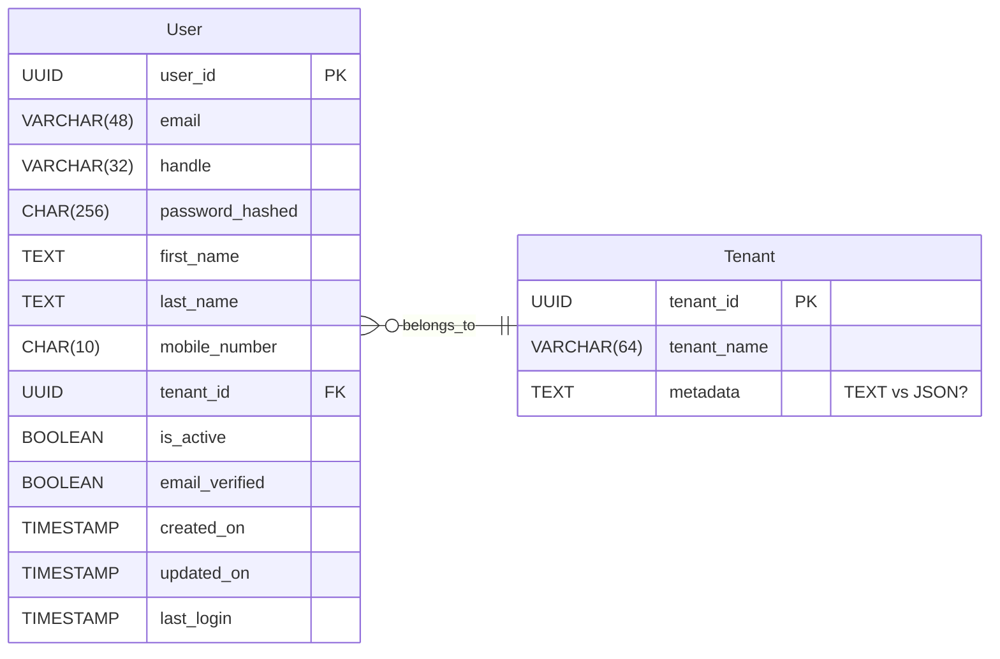
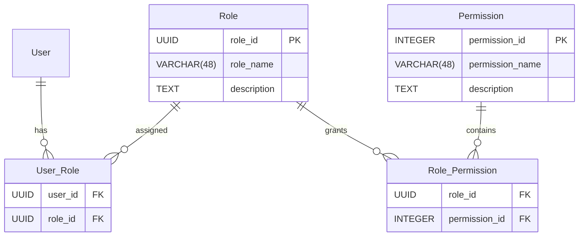

# Exercise 0 - User Service

**Goal:** Design a lean, extensible user service that can be used across various SaaS products in different industries.

## Core User Schema

### Fields

- **- Email/Username** - Allow login; rec. private
    - Tradeoff - Using username exclusively for login is more secure however a separate username adds significant complexity
    - The user may manage this complexity by using the same username everywhere...
    - **R** Prefer email as username
- **+ Handle** - User chosen id often preceded by @, for public facing profiles, e.g. @CabbageCorp
    - Username/email should be kept private to mitigate hacking attempts

### User Authorities (Permissions)
