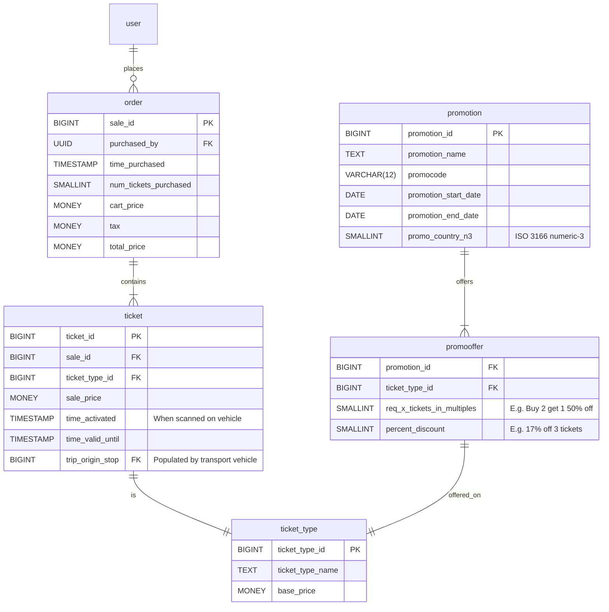
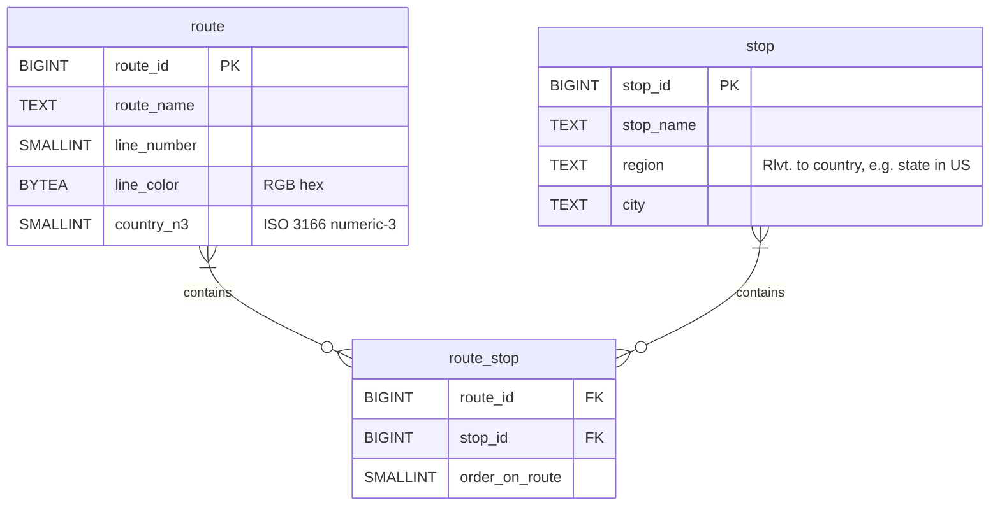

# \[Proj.] Public Transportation Schema

**Objective:** Design a transportation service that spans across the planet.
- Supports common transportation options, e.g. bus, rail, ferry/boat
 

- Commuter goal? (why are they using public tranportation)

## Ticket Svc

### Routes Svc

 

- Do we charge per ride, or per trip?
    - A trip can consist of multiple transfers b/w routes.